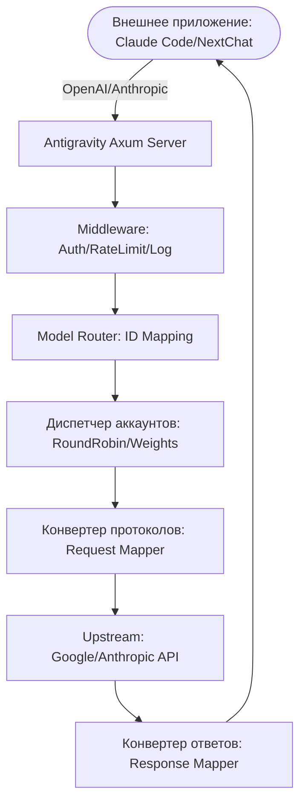

# Antigravity Tools 🚀
> Профессиональная система управления AI-аккаунтами и проксирования протоколов (v3.3.35)

<div align="center">
  

  <h3>Ваш персональный высокопроизводительный AI-шлюз</h3>
  <p>Больше, чем просто управление аккаунтами — это ультимативное решение, разрушающее барьеры API.</p>
  
  <p>
    <a href="https://github.com/lbjlaq/Antigravity-Manager">
      
    </a>
    
    
    
    
  </p>

  <p>
    <a href="#-основные-возможности">Основные возможности</a> • 
    <a href="#-обзор-интерфейса">Обзор интерфейса</a> • 
    <a href="#-техническая-архитектура">Техническая архитектура</a> • 
    <a href="#-установка">Установка</a> • 
    <a href="#-быстрый-старт">Быстрый старт</a>
  </p>

  <p>
    <a href="./README.md">简体中文</a> | 
    <a href="./README_EN.md">English</a> |
    <strong>Русский</strong>
  </p>
</div>

---

**Antigravity Tools** — это полнофункциональное настольное приложение, разработанное для программистов и энтузиастов AI. Оно идеально сочетает в себе управление несколькими учетными записями, преобразование протоколов и интеллектуальное планирование запросов, предоставляя вам стабильную, быструю и недорогую **локальную AI-станцию**.

С помощью этого приложения вы можете превратить обычные веб-сессии (Google/Anthropic) в стандартизированные API-интерфейсы, полностью устраняя пропасть между протоколами разных производителей.

## 💖 Спонсоры (Sponsors)

|  | Спасибо **PackyCode** за спонсорскую поддержку проекта! PackyCode — надежный и эффективный провайдер API-шлюзов, предоставляющий доступ к Claude Code, Codex, Gemini и другим сервисам. Для пользователей нашего проекта действует специальное предложение: зарегистрируйтесь по [этой ссылке](https://www.packyapi.com/register?aff=Ctrler) и введите промокод **“Ctrler”** при пополнении, чтобы получить **скидку 10%**. |
| :--- | :--- |

### ☕ Поддержать проект (Support)

Если этот проект оказался вам полезен, вы можете поддержать автора!

<a href="https://www.buymeacoffee.com/Ctrler" target="_blank"></a>

| Alipay | WeChat Pay | Buy Me a Coffee |
| :---: | :---: | :---: |
|  |  |  |

## 🌟 Детальный обзор функций (Detailed Features)

### 1. 🎛️ Умная панель управления (Smart Dashboard)
*   **Глобальный мониторинг в реальном времени**: Мгновенная оценка состояния всех аккаунтов, включая среднюю **остаточную квоту** для Gemini Pro, Gemini Flash, Claude и Gemini Image.
*   **Умная рекомендация (Smart Recommendation)**: Система в реальном времени анализирует избыточность квот всех аккаунтов и рекомендует "лучший аккаунт", поддерживая **переключение в один клик**.
*   **Снимок активных аккаунтов**: Наглядное отображение процента квоты и времени последней синхронизации для активных аккаунтов.

### 2. 🔐 Мощный менеджер аккаунтов (Account Management)
*   **OAuth 2.0 Авторизация (Авто/Ручная)**: При добавлении аккаунта генерируется ссылка для авторизации, которую можно открыть в любом браузере; после успешного входа приложение автоматически завершит процесс и сохранит данные (при необходимости можно нажать "Я авторизовался, продолжить" для ручного завершения).
*   **Многомерный импорт**: Поддержка ввода одиночных токенов, пакетного импорта из JSON (например, резервные копии из других инструментов), а также автоматическая горячая миграция из базы данных старой версии V1.
*   **Шлюзовой вид**: Поддержка переключения между "Списком" и "Сеткой". Встроено обнаружение блокировок 403, автоматическая пометка и пропуск аккаунтов с аномальными правами.

### 3. 🔌 Преобразование протоколов и реле (API Proxy)
*   **Мульти-протокольная адаптация (Multi-Sink)**:
    *   **Формат OpenAI**: Предоставляет эндпоинт `/v1/chat/completions`, совместимый с 99% существующих AI-приложений.
    *   **Формат Anthropic**: Предоставляет нативный интерфейс `/v1/messages`, поддерживающий полный функционал **Claude Code CLI** (например, Chain of Thought, системные промпты).
    *   **Формат Gemini**: Поддержка прямого вызова через официальный Google SDK.
*   **Интеллектуальное самовосстановление**: При возникновении ошибок `429 (Too Many Requests)` или `401 (Expire)` бэкенд за миллисекунды запускает **автоматический повтор и тихую ротацию**, обеспечивая непрерывность бизнес-процессов.

### 4. 🔀 Центр маршрутизации моделей (Model Router)
*   **Серийный маппинг**: Вы можете группировать сложные оригинальные ID моделей в "семейства спецификаций" (например, перенаправлять все запросы GPT-4 на `gemini-3-pro-high`).
*   **Экспертное перенаправление**: Поддержка пользовательского маппинга моделей с помощью регулярных выражений для точного контроля того, какая модель обрабатывает каждый запрос.
*   **Умная уровневая маршрутизация (Tiered Routing)**: [NEW] Система автоматически расставляет приоритеты на основе типа аккаунта (Ultra/Pro/Free) и частоты сброса квот, в первую очередь расходуя квоты аккаунтов с быстрым сбросом, обеспечивая стабильность сервиса при высокой нагрузке.
*   **Тихая деградация фоновых задач**: [NEW] Автоматическое распознавание фоновых запросов от инструментов типа Claude CLI (например, генерация заголовков) и умное перенаправление их на Flash-модели, чтобы не тратить квоты дорогих моделей.

### 5. 🎨 Мультимодальность и поддержка Imagen 3
*   **Продвинутый контроль качества**: Поддержка автоматического маппинга параметров `size` из OpenAI (например, `1024x1024`, `16:9`) в соответствующие спецификации Imagen 3.
*   **Поддержка огромных Body**: Бэкенд поддерживает Payload до **100MB**, что с запасом хватает для распознавания 4K изображений.

## 📸 Обзор интерфейса (GUI Overview)

| | |
| :---: | :---: |
|  <br> Панель управления |  <br> Список аккаунтов |
|  <br> О программе |  <br> Настройки API Прокси |
|  <br> Настройки системы | |

### 💡 Примеры использования (Usage Examples)

| | |
| :---: | :---: |
|  <br> Claude Code веб-поиск |  <br> Интеграция с Cherry Studio |
|  <br> Генерация изображений Imagen 3 |  <br> Подключение Kilo Code |

## 🏗️ Техническая архитектура (Architecture)



##  Установка (Installation)

### Вариант A: Установка через терминал (рекомендуется для macOS и Linux)
Если у вас установлен [Homebrew](https://brew.sh/), вы можете быстро установить приложение командой:

```bash
# 1. Подключить Tap репозиторий
brew tap lbjlaq/antigravity-manager https://github.com/lbjlaq/Antigravity-Manager

# 2. Установить приложение
brew install --cask antigravity-tools
```
> **Совет**: 
> - **macOS**: Если возникли проблемы с правами, добавьте флаг `--no-quarantine`.
> - **Linux**: После установки AppImage будет автоматически добавлен в путь и получит права на исполнение.

### Вариант B: Ручная загрузка
Перейдите в [GitHub Releases](https://github.com/lbjlaq/Antigravity-Manager/releases) и скачайте пакет для вашей системы:
*   **macOS**: `.dmg` (Поддержка Apple Silicon и Intel)
*   **Windows**: `.msi` или портативная версия `.zip`
*   **Linux**: `.deb` или `AppImage`

### Вариант C: Развертывание на удаленном сервере (Headless Linux)
Если вам нужно запустить приложение на удаленном Linux-сервере без графического интерфейса (например, Ubuntu/Debian/CentOS), используйте наше решение для развертывания **Headless (Xvfb)** одной командой:

```bash
curl -fsSL https://raw.githubusercontent.com/lbjlaq/Antigravity-Manager/main/deploy/headless-xvfb/install.sh | sudo bash
```
> **Примечание**: Это решение эмулирует графическое окружение через Xvfb, потребление ресурсов (RAM/CPU) будет выше, чем у чисто бэкенд-приложения.
> **Подробнее**: [Руководство по развертыванию на сервере (deploy/headless-xvfb)](./deploy/headless-xvfb/README.md)

---

Copyright © 2024-2026 [lbjlaq](https://github.com/lbjlaq)

### 🛠️ Устранение неполадок (Troubleshooting)

#### macOS: "Приложение повреждено, невозможно открыть"?
Из-за механизмов безопасности macOS скачанные не из App Store приложения могут вызывать эту ошибку. Вот как это исправить:

1.  **Исправление через терминал** (Рекомендуется):
    Откройте терминал и выполните:
    ```bash
    sudo xattr -rd com.apple.quarantine "/Applications/Antigravity Tools.app"
    ```
2.  **Совет для Homebrew**:
    При установке через brew добавьте флаг `--no-quarantine`:
    ```bash
    brew install --cask --no-quarantine antigravity-tools
    ```

## 🔌 Быстрый старт

### 🔐 Процесс авторизации OAuth (Добавление аккаунта)
1. Откройте "Accounts / Аккаунты" → "Добавить" → "OAuth".
2. В появившемся окне ссылка генерируется заранее; нажмите на неё, чтобы скопировать в буфер обмена, затем откройте в нужном браузере и пройдите авторизацию.
3. После завершения авторизации браузер откроет локальную страницу callback и покажет "✅ Authorization Successful!".
4. Приложение автоматически продолжит процесс и сохранит аккаунт; если этого не произошло, нажмите "Я авторизовался, продолжить" для ручного завершения.

> Совет: Ссылка авторизации содержит одноразовый порт callback, пожалуйста, всегда используйте свежую ссылку из окна; если во время авторизации приложение было закрыто, браузер может выдать ошибку `localhost refused connection`.

### Как подключить Claude Code CLI?
1.  Запустите Antigravity и включите сервис на странице "API Proxy".
2.  Выполните в терминале:
```bash
export ANTHROPIC_API_KEY="sk-antigravity"
export ANTHROPIC_BASE_URL="http://127.0.0.1:8045"
claude
```

### Как подключить Kilo Code?
1.  **Выбор протокола**: Рекомендуется использовать **протокол Gemini**.
2.  **Base URL**: Укажите `http://127.0.0.1:8045`.
3.  **Внимание**: 
    - **Ограничение протокола OpenAI**: Kilo Code в режиме OpenAI добавляет нестандартный путь `/v1/chat/completions/responses`, что вызывает 404 ошибку в Antigravity. Пожалуйста, используйте режим Gemini.
    - **Маппинг моделей**: Имена моделей в Kilo Code могут отличаться. Если соединение не устанавливается, настройте пользовательский маппинг в разделе "Model Router".

### Как использовать в Python?
```python
import openai

client = openai.OpenAI(
    api_key="sk-antigravity",
    base_url="http://127.0.0.1:8045/v1"
)

response = client.chat.completions.create(
    model="gemini-3-flash",
    messages=[{"role": "user", "content": "Привет, представься пожалуйста"}]
)
print(response.choices[0].message.content)
```

## 📝 Разработчики и Сообщество

*   **История изменений (Changelog)**:
    *   **v3.3.35 (2026-01-16)**:
        - **Значительное улучшение синхронизации CLI (CLI Sync Enhancements)**:
            - **Поддержка нескольких профилей**: Теперь поддерживается синхронизация множества конфигурационных файлов для каждого CLI. Охватывает Claude Code (`settings.json`, `.claude.json`), Codex (`auth.json`, `config.toml`) и Gemini CLI (`.env`, `settings.json`, `config.json`).
            - **Привилегия без входа для Claude**: При синхронизации в `~/.claude.json` автоматически добавляется `"hasCompletedOnboarding": true`, что позволяет новым пользователям пропустить начальный вход/обучение в Claude CLI.
            - **Улучшенный просмотр файлов**: Страница деталей конфигурации обновлена до режима "вкладок", позволяя удобно переключаться между всеми локальными конфигами CLI в одном окне.
        - **Глубокая оптимизация UI/UX**:
            - **Унификация диалогов**: Подтверждение "Сброса настроек" теперь использует `ModalDialog` в едином стиле приложения вместо нативного браузерного окна.
            - **Оптимизация отображения**: Улучшена иконка сброса; оптимизированы теги статуса (без переноса строк), что решило проблемы верстки на HiDPI экранах.
            - **Упрощение версий**: Улучшена логика извлечения версий CLI, теперь отображается только чистая версия (например, v0.86.0).
        - **Исправление сохранения подписи Claude Thinking (Fix Issue #752)**:
            - **Проблема**: В v3.3.34 терялась подпись `signature` в блоках мышления (`thinking`), что приводило к ошибкам при переключении моделей.
            - **Решение**: Добавлена логика извлечения и сохранения подписи в `collector.rs`. Внедрена строгая валидация подписи в `request.rs` с автоматическим понижением до обычного текста при невалидной подписи. Добавлен механизм автоматического повтора при ошибке 400.
        - **Исправление синхронизации данных мониторинга API (Thanks to @xycxl)**:
            - Устранено дублирование логов и неточности счетчиков на странице мониторинга. Оптимизирован механизм обновления (debounce) для повышения плавности интерфейса.
    
    <details>
    <summary>Показать логи старых версий (v3.3.34 и ранее)</summary>
    
    *(Список изменений предыдущих версий доступен в файле README.md на китайском или английском языке)*
    
    </details>

## 👥 Ключевые участники (Contributors)

<a href="https://github.com/lbjlaq"></a>
<a href="https://github.com/XinXin622"></a>
<a href="https://github.com/llsenyue"></a>
... и многие другие.

Спасибо всем разработчикам, вложившим свой труд и мудрость в этот проект.

*   **Лицензия**: Основано на **CC BY-NC-SA 4.0**, **любая коммерческая деятельность строго запрещена**.
*   **Безопасность**: Все данные аккаунтов хранятся в зашифрованном виде в локальной базе SQLite. Данные не покидают ваше устройство, если не включена синхронизация.

---

<div align="center">
  <p>Если этот инструмент был вам полезен, поставьте ⭐️ на GitHub!</p>
  <p>Copyright © 2025 Antigravity Team.</p>
</div>
